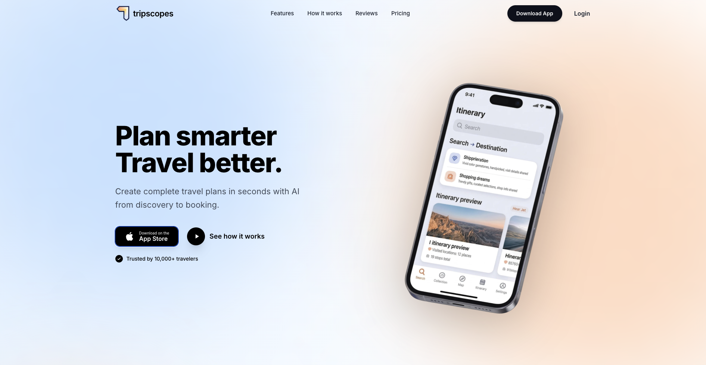
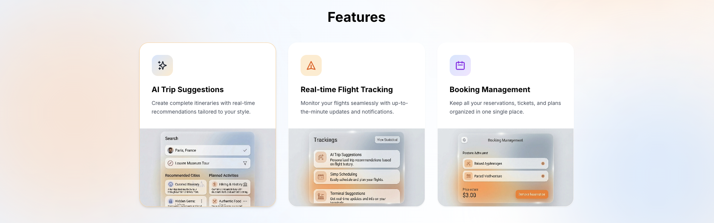
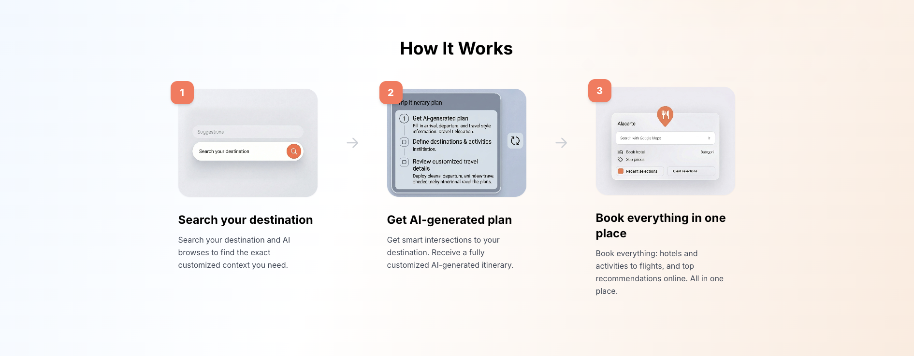

# 🌍 Tripscopes

<p align="center">
  
</p>

> **Plan smarter. Travel better.** Build complete travel plans in seconds, get inspired by fellow wanderers, and let our AI give you a cheeky nudge in the right direction.

Planning a holiday shouldn't be an absolute faff. **Tripscopes** is your ultimate travel planning hub. Whether you want to have a nosey at what other people are planning or build your own getaway from scratch, we've got you sorted. AI doesn't run the show here; it just drops brilliant suggestions so your next trip is absolutely spot on.

---

## ✨ The Brilliant Bits

<p align="center">
  
</p>

* 🗺️ **Community Inspiration:** Have a gander at itineraries built by other travellers. See a brilliant plan? Nick their best ideas for your own trip (we won't tell).
* 🤖 **AI-Powered Nudges:** When you're stuck for ideas, our AI sidekick chips in with bespoke, real-time recommendations tailored to your vibe.
* ✈️ **Real-time Flight Tracking:** Keep an eye on your flights with up-to-the-minute updates.
* 📅 **Booking Management:** Keep all your reservations, tickets, and plans sorted in one single, tidy place.
* 💷 **Live Price Tracking:** Because nobody likes overpaying for a cheeky weekend away.

---

## 🛠️ How It Works

<p align="center">
  
</p>

1.  **Search & Get Inspired:** Pop in where you fancy going. Browse community trips or let the AI browse the web to find the exact customised context you need.
2.  **Build Your Plan:** Mix and match ideas. Let the AI fill in the gaps with smart intersections to create a fully customised itinerary.
3.  **Book everything in one place:** Sort out your hotels, activities, and flights without leaving the app. Easy peasy.

---

## 🌧️ The Story: This Wasn't Planned

<p align="center">
  
</p>

I realised this while standing in the freezing rain in London, trying to sort out my next move: **planning a trip shouldn't be more exhausting than the trip itself.** It was absolutely tipping it down, and I was proper fed up with juggling maps, notes, and keeping track of where everyone else was going.

So, I built Tripscopes. Less planning, more exploring.

Cheers,
**Emre** - *Indie Developer* 🚀

---

## 💻 Tech Stack

Built with some proper good tools:
* **React** 
* **Vite** 
* **Tailwind CSS** 

## 🚀 Getting Started

Want to run this locally and have a tinker? 

```bash
# Clone the repo
git clone [https://github.com/emrecanakisik/TripScops-Web-App.git](https://github.com/emrecanakisik/TripScops-Web-App.git)

# Get into the folder
cd TripScops-Web-App

# Install the dependencies
npm install

# Fire it up!
npm run dev